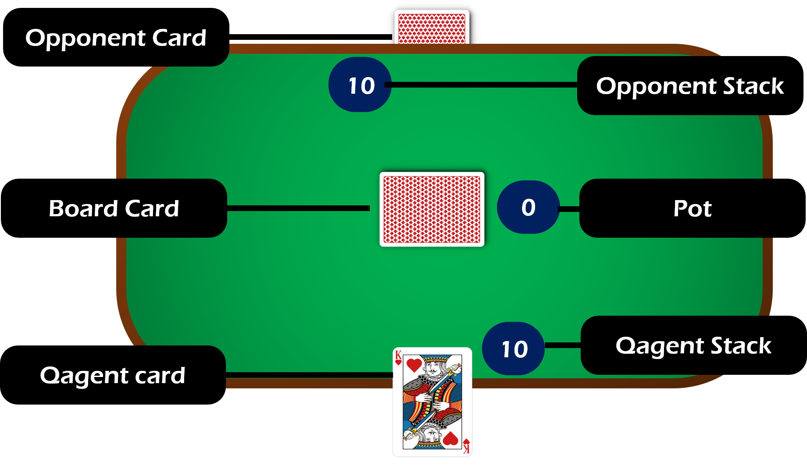

# Project explanation

The aim of this project is to learn and implement basics of QLearning process.

Below is the logic of the project in a GIU display (not implemented, only for informative purpose).

## Initialisation

