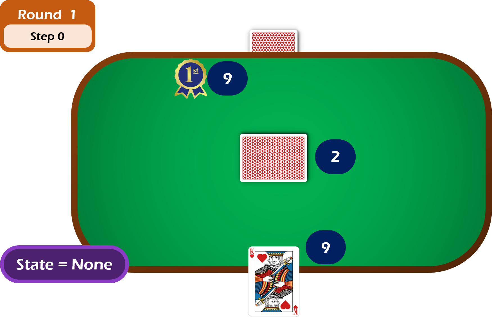
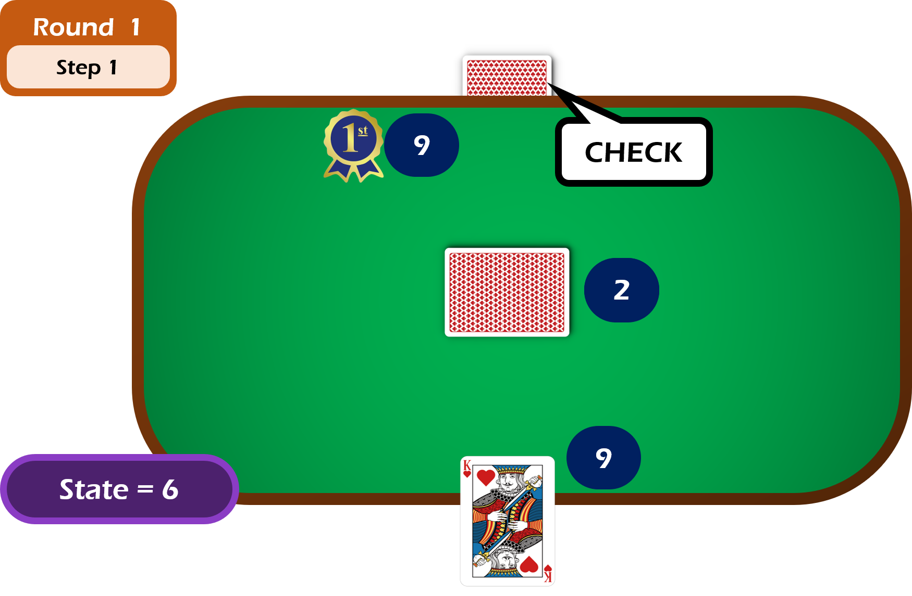
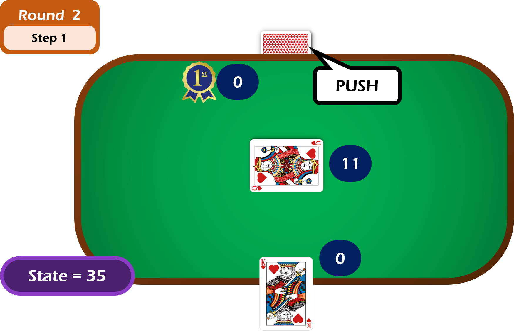
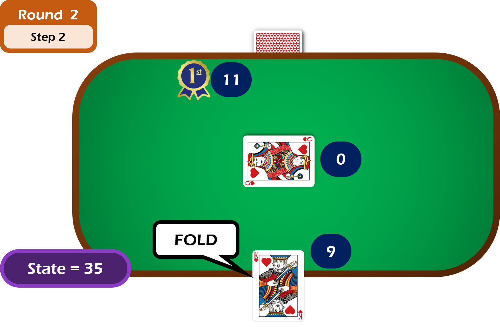

# Project overall view (read this first!)

The aim of this project is to learn and implement basics of QLearning process (Agent, Environment, ...).

Below is the logic of the project in a GIU display (not implemented, only for informative purpose).

## Initialisation

The Game class will give 10 stacks to each players. The pot is set to 0. And one card is given to each player and to the board.

To be played, the game require one stack of each player. Now the pot is 2 stacks, and each player's stack is 9.

In addition, the game randomly chooses a first player. Here, it is the Opponent:

## 1st Round
### 1st Step

Now, our QAgent wait for the Opponent action choice (according to its policy). Here, the Opponent decides to Check:

The environment (Game + Opponent) give a state to our QAgent.
Here it is 6 (refers to the QTable structure)

### 2nd Step

Now, our QAgent will choose an action:
- in exploration it will be random
- in exploitation it will consider the state and the QTable

Here, the QAgent decides to Check too:

The 1st round is over, we moe on the 2nd round.

## 2nd Round
### 1st Step

One more time, our QAgent wait for the Opponent action choice. Here, the Opponent decides to Push:

### 2nd Step
Now, our QAgent chooses to Fold:

## Learning part
The game is now over, the QAgent receive a reward (-1 in that case) from the environment. It will use it to update its QTable.

Two QValue will be updated:
- the one of [State=35;Action=Fold] with a direct present reward
- the one of [State=6;Action=Check] with a future reward using a backpropagation process
