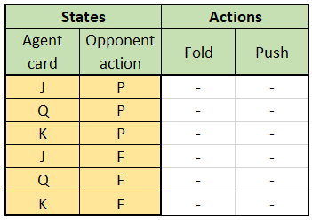
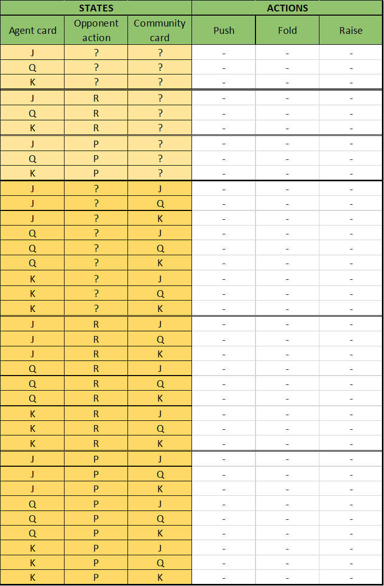

# RL for Texas Hold'em Poker

- [Leduc Push and Fold](#Leduc-Push-and-Fold)
- [Leduc Push, Check, Fold (2 rounds)](#leduc-push-check-fold-2-rounds)

## Leduc Push and Fold

Our first step was to implement Push or Fold Leduc Hold'em.

### Game rules

#### Init

There are two players with the same stacksize. At the begining of the game, both players spend a blind (1 unit) in the pot.

#### First Step

Then, the firstplayer will decide either to Push or Fold based on its card.

#### Second Step

Now, the secondplayer will decide either to Push or Fold based on its card and the firstplayer action.

### Action space

- Push
- Fold

### State space

- Our hand : J, Q, K
- Opponent action : Unknown or Push

For a total of 3 * 2 = 6 states.

### QTable Structure
</img>
### Results
#### Random Agent
We know the optimal policy of this game against a random agent : Fold when we have a J, Push when we have a K, and 50/50 when we have a Q (here, we aren't considering the opponent action because it's a random agent).

Here are the results : 

#### Naive Agent
To force our agent to consider the opponent action, we should change the opponent policy. In that case, the naive agent will always Fold when it has a Q or a K, else it pushes.

Here, our new agent optimal policy will to always Push, no matter its hand.

Here are the results
## Leduc Push, Check, Fold (2 rounds)
Our first step was to implement Push or Fold Leduc Hold'em.

### Game rules

#### Init

This is a 2 rounds game : Preflop and Postflop
There are two players with the same stacksize (10 units). At the begining of the game, both players spend a blind (1 unit) in the pot.

```python
#Creating a Game
game=LeducGame()
#print the game state
print(game)
```

```bash
FirstPlayer = 0 
Hand1 = 0 
Hand2 = 0 
Board = 1 
Deck = [1, 2, 2]
Result = 0
Stack1=9
Stack2=9
Pot=2
Step=1
Round=0
GameIsOver=0
```

Below is the logic of a round :

#### First Step

Then, the firstplayer will decide either to Push, Check or Fold based on its card.

Eg : 
```python
#firstplayer action
game.step(1)
#print the game state
print(game)
```

#### Second Step

Now, the secondplayer will decide either to Push, Check or Fold based on its card and the firstplayer action.

Eg : 
```python
#firstplayer action
game.step(1)
print(game)
#secondplayer action
game.step(1)
print(game)
```
#### Third Step (optional)

If the firstplayer Checks and the secondplayer Pushes, then we need an extra step where the firstplayer will decide either to Push or Fold.

Eg : 
```python
#firstplayer action
game.step(1)
print(game)
#secondplayer action
game.step(2)
print(game)
#firstplayer 2nd action
game.step(2)
print(game)
```

### Action space

- Fold (0)
- Check (1)
- Push (2)

PS : Depeding on the state, some action might be prohibited.
### State space

- Our hand : J, Q, K --> (0,1,2)
- Board card : J, Q, K --> (0,1,2)
- Opponent action : Check or Push --> (0,2)
- Round : 1st or 2nd --> (0,1)

For a total of 3 * 3 * 2 * 2 = 36 states (6 times higher than the Push or Fold Leduc).

### QTable structure
</img>
