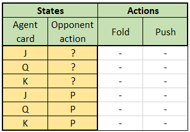
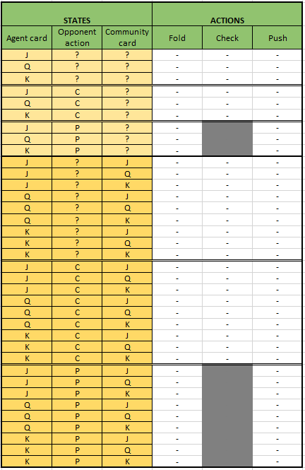

# RL for Texas Hold'em Poker

- [Leduc Push and Fold](#Leduc-Push-and-Fold)
- [Leduc Push, Check, Fold (2 rounds)](#leduc-push-check-fold-2-rounds)

## Leduc Push and Fold

Our first step was to implement Push or Fold Leduc Hold'em.

### Game rules

#### Init

There are two players with the same stacksize. At the begining of the game, both players spend a blind (1 unit) in the pot.

#### First Step

Then, the firstplayer will decide either to Push or Fold based on its card.

#### Second Step

Now, the secondplayer will decide either to Push or Fold based on its card and the firstplayer action.

### Action space

- Push
- Fold

### State space

- Our hand : J, Q, K
- Opponent action : Unknown or Push

For a total of 3 * 2 = 6 states.

### QTable Structure
</img>
### Results
#### Random Agent
We know the optimal policy of this game against a random agent : Fold when we have a J, Push when we have a K, and 50/50 when we have a Q (here, we aren't considering the opponent action because it's a random agent).

Here is the code :
```python
randAgent=RandAgent()

env=Environment(randAgent)
qagent=QAgent()

for i in range(epochs_number): 

    env.reset()
    qagent.set_state(env.get_state())
    qagent_action=qagent.explore_action()
    reward=env.reward(qagent_action,env.get_state())
    qagent.update(qagent_action,reward)
    
print("QTable=",qagent.qtable)
```
And here are the results :

```bash
QTable=
[[-0.99982304 -0.16148437]
 [-0.99973028  2.14646803]
 [-0.99996356  2.51629552]
 [-0.98669721 -1.23603417]
 [-0.9962429   1.87547468]
 [-0.9835768   6.58635557]]
 ```

#### Naive Agent
To force our agent to consider the opponent action, we should change the opponent policy. In that case, the naive agent will always Fold when it has a Q or a K, else it pushes.

Here, our new agent optimal policy will to always Push, no matter its hand.

Here is the code :
```python
naiveAgent=NaiveAgent()

env=Environment(naiveAgent)
envTest=Environment(naiveAgent)
qagent=QAgent()

for i in range(epochs_number): 

    env.reset()
    qagent.set_state(env.get_state())
    qagent_action=qagent.explore_action()
    reward=env.reward(qagent_action,env.get_state())
    qagent.update(qagent_action,reward)
    
print("QTable=",qagent.qtable)
```
And here are the results :

```bash
QTable=
[[-0.9999383   0.92845981]
 [-0.999045    1.83832357]
 [-0.99987099  2.11402158]
 [-0.81469798  0.        ]
 [-0.94185026  5.54625505]
 [-0.93538918  2.89580639]]
 ```
 
 We clearly see that our agent will always push.
 
## Leduc Push, Check, Fold (2 rounds)
Our first step was to implement Push or Fold Leduc Hold'em.

### Game rules

#### Init

This is a 2 rounds game : Preflop and Postflop
There are two players (Player1, Player2 respectively for QAgent,Opponent) with the same stacksize (10 units).
The deck is composed of 6 cards (J,J,Q,Q,K,K).
At the begining of the game, both players spend a blind (1 unit) in the pot. 

The game assigns:
- randomly the firstplayer (0,1 respectively for Player1,Player2).
- one card to each player (0,1,2 respectively for J,Q,K). This card is stored in Hand variable (Hand1, Hand2 respectiveley for Player1, Player2).
- one board card (0,1,2 respectively for J,Q,K). This card is stored in Boardcard variable.
- the remaining deck
- the best hand (-1,0,1 respectively for Hand2,Draw,Hand1). This value is stored in result variable. 
- the current round (0,1 respectively for round1,round2)
- the current step of the round (0,1,2 respectively for step1,step2,step3) ([Steps explanation](#steps-explanation)).
- the boolean GameIsOver (0,1 respectively for No,Yes)

```python
#Creating a Game
game=LeducGame()
#print the game state
print(game)
```

```bash
FirstPlayer = 0 
Hand1 = 0 
Hand2 = 0 
Boardcard = 1 
Deck = [1, 2, 2]
Result = 0
Stack1=9
Stack2=9
Pot=2
Round=0
Step=1
GameIsOver=0
```

Below is the logic of a round :

#### Steps explanation

##### First Step

Then, the firstplayer will decide either to Push, Check or Fold based on its card.

Eg : 
```python
#firstplayer action
game.step(1)
#print the game state
print(game)
```

##### Second Step

Now, the secondplayer will decide either to Push, Check or Fold based on its card and the firstplayer action.

Eg : 
```python
#firstplayer action
game.step(1)
print(game)
#secondplayer action
game.step(1)
print(game)
```
##### Third Step (optional)

If the firstplayer Checks and the secondplayer Pushes, then we need an extra step where the firstplayer will decide either to Push or Fold.

Eg : 
```python
#firstplayer action
game.step(1)
print(game)
#secondplayer action
game.step(2)
print(game)
#firstplayer 2nd action
game.step(2)
print(game)
```

### Action space

- Fold (0)
- Check (1)
- Push (2)

PS : Depeding on the state, some action might be prohibited.
### State space

- Our hand : J, Q, K --> (0,1,2)
- Board card : J, Q, K --> (0,1,2)
- Opponent action : Check or Push --> (0,2)
- Round : 1st or 2nd --> (0,1)

For a total of 3 * 3 * 2 * 2 = 36 states (6 times higher than the Push or Fold Leduc).

### QTable structure
</img>

## Agents
### Random Agent
The random agent choose a random action among the allowed actions for each case.

### Greedy Agent
The greedy agent is a probabilistic and deterministic agent. It will choose an action for each case according to the table bellow:

</img>
